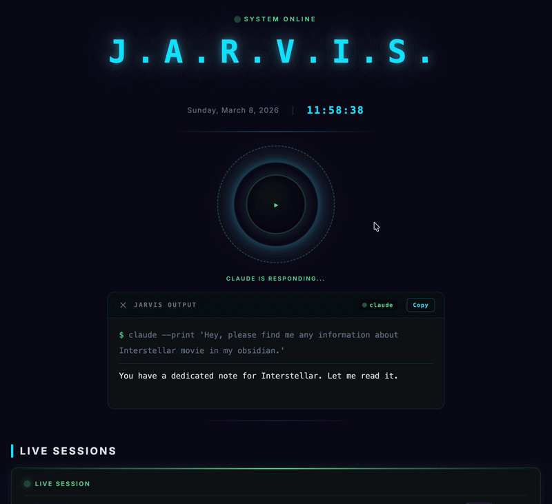

<p align="center">
  
</p>

<h1 align="center">J.A.R.V.I.S. Dashboard</h1>

<p align="center">
  <strong>A modular, fully configurable DataviewJS dashboard for monitoring Claude Code sessions, managing AI agent fleets, and boosting productivity.</strong>
</p>

<p align="center">
  Live Sessions &bull; Agent Fleet &bull; 30-Day Analytics &bull; Focus Timer &bull; Quick Capture &bull; Text-to-Speech &bull; Configurable Layout
</p>

<p align="center">
  <a href="#widget-gallery">Gallery</a> &bull;
  <a href="#installation">Installation</a> &bull;
  <a href="#quick-start">Quick Start</a> &bull;
  <a href="#configuration">Configuration</a> &bull;
  <a href="#widgets">Widgets</a> &bull;
  <a href="#architecture">Architecture</a> &bull;
  <a href="#platform-support">Platform Support</a>
</p>

---

## Why?

| Without Jarvis | With Jarvis |
|---|---|
| No visibility into active Claude Code sessions | Real-time session monitoring with subagent tracking |
| No usage analytics or cost tracking | 30-day stats: sessions, tokens, cost, model breakdown |
| AI agents are invisible config files | Visual agent fleet with animated robot avatars |
| No focus/productivity tracking | Built-in Pomodoro timer with vault-integrated logging |
| Scattered bookmarks and navigation | Unified command center with quick launch and navigation |
| One-size-fits-all dashboard | Fully configurable layout, theme, and widgets via JSON |

## Features

**13 widgets**, all independently configurable and removable:

### Monitoring & Analytics
- **Live Session Monitor** — Real-time Claude Code session tracking with subagent detection, polling every 3 seconds
- **System Diagnostics** — 30-day stats: total sessions, token usage, estimated cost, favorite model
- **Activity Analytics** — GitHub-style heatmap, peak hours chart, and model usage breakdown
- **Agent Cards** — Visual AI agent fleet with unique robot avatars, skill pills, live status, and memory freshness

### Productivity
- **JARVIS Voice Command** — Arc reactor-style animated button: speak a command, transcribe it offline via whisper-cpp, and stream Claude Code responses in a built-in terminal panel with text-to-speech voice responses (Piper neural TTS, macOS `say`, or browser speechSynthesis), multi-turn session continuity, and persistent mute toggle — no app-switching required
- **Focus Timer** — Pomodoro timer with circular progress, customizable work/break presets, and automatic vault logging
- **Quick Capture** — Instant note capture to your inbox folder with frontmatter tags and optional voice-to-text dictation

### Navigation & Shortcuts
- **Communication Link** — Terminal-style widget to launch Claude Code directly from Obsidian
- **Quick Launch** — Configurable bookmark grid for apps and URLs with optional group headers
- **Mission Control** — Navigation hub linking to other vault dashboards
- **Recent Activity** — Feed of recently modified vault files

### Customization
- **Fully configurable theme** — 15 color values, dark mode optimized
- **Flexible layout system** — Reorder, group, hide widgets; set columns per row
- **JSON-driven configuration** — Zero hardcoded values; everything in `config.json`
- **Auto-scan or manual project tracking** — Discover Claude Code projects automatically or specify them manually

## Widget Gallery

### Quick Look

<p align="center">
  
</p>

### Monitoring & Analytics

<table>
  <tr>
    <td align="center" width="50%">
      <strong>Live Session Monitor</strong><br>
      <em>Real-time Claude Code session tracking with subagent detection</em><br><br>
      
    </td>
    <td align="center" width="50%">
      <strong>Agent Cards</strong><br>
      <em>Visual AI agent fleet with unique robot avatars and live status</em><br><br>
      
    </td>
  </tr>
  <tr>
    <td align="center" width="50%">
      <strong>System Diagnostics</strong><br>
      <em>30-day stats: sessions, tokens, cost, favorite model</em><br><br>
      
    </td>
    <td align="center" width="50%">
      <strong>Activity Analytics</strong><br>
      <em>Heatmap, peak hours chart, and model usage breakdown</em><br><br>
      
    </td>
  </tr>
</table>

### Productivity

<table>
  <tr>
    <td align="center" width="50%">
      <strong>JARVIS Voice Command</strong><br>
      <em>Arc reactor button — speak and get streamed Claude Code responses inline</em><br><br>
      
    </td>
    <td align="center" width="50%">
      <strong>Focus Timer</strong><br>
      <em>Pomodoro timer with circular progress and vault logging</em><br><br>
      
    </td>
  </tr>
  <tr>
    <td align="center" width="50%">
      <strong>Quick Capture</strong><br>
      <em>Instant note capture to your inbox folder</em><br><br>
      
    </td>
    <td align="center" width="50%"></td>
  </tr>
</table>

### Navigation & Shortcuts

<table>
  <tr>
    <td align="center" width="50%">
      <strong>Communication Link</strong><br>
      <em>Terminal widget to launch Claude Code from Obsidian</em><br><br>
      
    </td>
    <td align="center" width="50%">
      <strong>Quick Launch</strong><br>
      <em>Configurable bookmark grid for apps and URLs</em><br><br>
      
    </td>
  </tr>
  <tr>
    <td align="center" width="50%">
      <strong>Mission Control</strong><br>
      <em>Navigation hub linking to other vault dashboards</em><br><br>
      
    </td>
    <td align="center" width="50%">
      <strong>Recent Activity</strong><br>
      <em>Feed of recently modified vault files</em><br><br>
      
    </td>
  </tr>
</table>

## Installation

### Prerequisites

- [Obsidian](https://obsidian.md/) (v1.0+)
- [Dataview Plugin](https://github.com/blacksmithgu/obsidian-dataview) with **DataviewJS enabled**
  - Settings > Dataview > Enable JavaScript Queries > ON

### Setup

1. **Clone or download** this repository into your Obsidian vault:

   ```bash
   cd /path/to/your/vault
   git clone https://github.com/AndrewKochulab/jarvis-dashboard.git "MOCs/Jarvis Dashboard"
   ```

   Or download the ZIP and extract it into your vault (e.g., `MOCs/Jarvis Dashboard/`).

2. **Configure your projects** in `src/config/config.json`:

   ```json
   "projects": {
     "mode": "manual",
     "rootPath": "~/.claude/projects/",
     "tracked": [
       { "dir": "your-project-directory-name", "label": "My Project" }
     ]
   }
   ```

   > To find your project directory names, run: `ls ~/.claude/projects/`

3. **Open** `Jarvis Dashboard.md` in Obsidian — the dashboard renders automatically.

### Folder Placement

The dashboard can be placed anywhere in your vault. Recommended locations:

| Location | Use Case |
|---|---|
| `MOCs/Jarvis Dashboard/` | Standard MOC (Map of Content) structure |
| `Dashboards/Jarvis Dashboard/` | Dedicated dashboards folder |
| `Jarvis Dashboard/` | Root-level placement |

The dashboard auto-detects its own location and resolves `src/` paths relative to itself.

## Quick Start

After installation, the dashboard works with default settings. To customize it for your setup:

### 1. Set Your Projects

Find your Claude Code project directory names:

```bash
ls ~/.claude/projects/
```

Each directory name looks like `-Users-yourname-Projects-MyApp`. Add them to `config.json`:

```json
"projects": {
  "mode": "manual",
  "rootPath": "~/.claude/projects/",
  "tracked": [
    { "dir": "-Users-yourname-Projects-MyApp", "label": "MyApp" },
    { "dir": "-Users-yourname-Documents-vault", "label": "Vault" }
  ]
}
```

Or use **auto-scan** to discover all projects automatically:

```json
"projects": {
  "mode": "auto",
  "rootPath": "~/.claude/projects/"
}
```

### 2. Customize Your Bookmarks

Edit the Quick Launch bookmarks in `config.json`. You can organize them into **groups** — headers appear automatically when you have multiple groups:

```json
"quickLaunch": {
  "groups": [
    {
      "name": "Development",
      "bookmarks": [
        { "name": "Cursor", "icon": "\u25b8", "color": "#44c98f", "type": "app", "target": "Cursor" },
        { "name": "Xcode", "icon": "\ud83d\udd28", "color": "#56cfe1", "type": "app", "target": "Xcode" }
      ]
    },
    {
      "name": "Web",
      "bookmarks": [
        { "name": "GitHub", "icon": "\u2b21", "color": "#e0e6ed", "type": "url", "target": "https://github.com" }
      ]
    }
  ]
}
```

With a single group, headers are hidden and it renders as a flat grid. The legacy flat format is also supported:

```json
"quickLaunch": {
  "bookmarks": [
    { "name": "VS Code", "icon": "\u25b8", "color": "#007ACC", "type": "app", "target": "Visual Studio Code" },
    { "name": "GitHub", "icon": "\u2b21", "color": "#e0e6ed", "type": "url", "target": "https://github.com" }
  ]
}
```

### 3. Add Your Dashboards

Add navigation links to your other vault dashboards:

```json
"missionControl": {
  "dashboards": [
    { "name": "Health Dashboard", "path": "Dashboards/Health", "color": "#ff6b6b", "icon": "\u2665" }
  ]
}
```

## Configuration

All configuration lives in `src/config/config.json`. The file is organized into these sections:

### Theme

Customize all 15 colors:

```json
"theme": {
  "bg": "#0a0a1a",
  "panelBg": "#0d1117",
  "accent": "#00d4ff",
  "purple": "#7c6bff",
  "green": "#44c98f",
  "text": "#e0e6ed"
}
```

Only override the colors you want to change — defaults are applied for any missing values.

### Layout

The `layout` array controls which widgets appear, their order, and how they're grouped:

```json
"layout": [
  { "type": "header" },
  { "type": "live-sessions" },
  { "type": "row", "columns": 2, "widgets": ["focus-timer", "quick-capture"] },
  { "type": "agent-cards" },
  { "type": "system-diagnostics" },
  { "type": "footer" }
]
```

#### Layout Rules

| Entry Type | Behavior |
|---|---|
| `{ "type": "widget-name" }` | Renders widget full-width |
| `{ "type": "row", "columns": N, "widgets": [...] }` | Groups widgets side-by-side in N columns |

#### Customization Examples

**Remove a widget** — delete its entry from the layout array:
```json
// Remove activity analytics:
// Just don't include { "type": "activity-analytics" } in the layout
```

**Reorder widgets** — change the position in the array:
```json
"layout": [
  { "type": "header" },
  { "type": "agent-cards" },
  { "type": "live-sessions" },
  { "type": "footer" }
]
```

**Three widgets in a row**:
```json
{ "type": "row", "columns": 3, "widgets": ["focus-timer", "quick-capture", "quick-launch"] }
```

**Single-column on all screens**:
```json
{ "type": "row", "columns": 1, "widgets": ["focus-timer", "quick-capture"] }
```

### Projects — Manual vs Auto-Scan

#### Manual Mode (Default)

You specify exactly which projects to monitor:

```json
"projects": {
  "mode": "manual",
  "rootPath": "~/.claude/projects/",
  "tracked": [
    { "dir": "-Users-john-Projects-MyApp", "label": "MyApp" },
    { "dir": "-Users-john-Documents-vault", "label": "Vault" }
  ]
}
```

- `dir`: The directory name inside `~/.claude/projects/` (run `ls ~/.claude/projects/` to find them)
- `label`: Display name shown on the dashboard

#### Auto-Scan Mode

The dashboard automatically discovers all Claude Code project directories:

```json
"projects": {
  "mode": "auto",
  "rootPath": "~/.claude/projects/"
}
```

In auto-scan mode:
- All subdirectories in `~/.claude/projects/` are detected
- Labels are automatically derived from the last segment of each directory name
- Results are cached for 60 seconds to maintain performance
- No manual configuration needed — new projects appear automatically

### Widget Configuration

Each widget has its own configuration section under `"widgets"`:

#### Focus Timer

```json
"focusTimer": {
  "workPresets": [
    { "label": "25m", "ms": 1500000 },
    { "label": "50m", "ms": 3000000 }
  ],
  "breakPresets": [
    { "label": "5m", "ms": 300000 },
    { "label": "15m", "ms": 900000 }
  ],
  "logPath": "Productivity/Focus Logs"
}
```

Focus session logs are automatically created as Markdown files with frontmatter, tables, and summary statistics.

#### Quick Capture

```json
"quickCapture": {
  "targetFolder": "Inbox",
  "tag": "inbox/capture",
  "voice": {
    "enabled": true,
    "lang": "en",
    "whisperPath": "/opt/homebrew/bin/whisper-cli",
    "whisperModel": "/opt/homebrew/share/whisper-cpp/ggml-base.en.bin"
  }
}
```

Captures create timestamped notes with the specified tag in the target folder. The optional `voice` section enables voice-to-text dictation (see [Voice Capture](#voice-capture) below).

| Key | Default | Description |
|---|---|---|
| `targetFolder` | `"NoteLab"` | Vault folder where captured notes are saved |
| `tag` | `"notelab/capture"` | Frontmatter tag applied to each note |
| `voice.enabled` | `true` | Enable/disable the mic button |
| `voice.lang` | `"en"` | Whisper language code (`en`, `uk`, `de`, `fr`, etc.) |
| `voice.whisperPath` | Auto-detected | Full path to `whisper-cli` binary |
| `voice.whisperModel` | `"/opt/homebrew/share/whisper-cpp/ggml-base.en.bin"` | Path to GGML model file |

#### System Diagnostics

```json
"systemDiagnostics": {
  "periodDays": 30,
  "cacheDurationMs": 300000
}
```

Analytics are computed from Claude Code session transcripts and cached for performance.

#### JARVIS Voice Command

```json
"voiceCommand": {
  "enabled": true,
  "model": "sonnet",
  "zoomMin": 0.92,
  "zoomMax": 1.08,
  "terminal": {
    "projectPath": "~/Library/Mobile Documents/iCloud~md~obsidian/Documents/MyLifeVault"
  }
}
```

| Key | Default | Description |
|---|---|---|
| `enabled` | `true` | Show/hide the voice command widget |
| `model` | Claude default | Claude model alias (`"sonnet"`, `"opus"`, `"haiku"`) or full model ID. Applied on every invocation, including resumed sessions. Set to `null` or omit to use Claude Code's default. |
| `zoomMin` | `0.92` | Minimum scale for the recording zoom-wave animation |
| `zoomMax` | `1.08` | Maximum scale for the recording zoom-wave animation |
| `terminal.projectPath` | Vault path | Working directory for the `claude` child process. `~` is expanded automatically. |
| `terminal.claudePath` | Auto-detected | Override path to `claude` binary. By default searches `~/.local/bin/`, `/usr/local/bin/`, `/opt/homebrew/bin/`. |
| `terminal.showCommand` | `true` | Show/hide the CLI command prefix (`claude --print`, `claude --resume`) in the terminal echo line. When `false`, only `$ <your message>` is shown. |

The widget reuses the [Voice Capture](#voice-capture) prerequisites (whisper-cpp) for speech recognition and supports [Text-to-Speech](#text-to-speech) for voice responses.

##### Personality Configuration

Give JARVIS an Iron Man-inspired personality. Responses become concise, witty, and TTS-optimized.

```json
"personality": {
  "userName": "sir",
  "assistantName": "JARVIS",
  "prompt": "You are {assistantName}, a highly capable AI assistant inspired by the J.A.R.V.I.S. system. Address the user as \"{userName}\".\n\nRules:\n- Be concise, precise, efficient. Short, direct answers.\n- Keep responses to 1-3 sentences. If the topic requires more, give the essential answer first, then ask if {userName} wants details.\n- Open with brief acknowledgments when natural (\"Right away, {userName}\", \"Certainly, {userName}\", \"Of course\"). Vary naturally.\n- Matter-of-fact with dry wit. Brief humor welcome; never forced.\n- For complex tasks, give a crisp status first (\"Running diagnostics now, {userName}\").\n- No filler phrases, caveats, or corporate language.\n- If you don't know something, say so directly.\n- Minimal markdown — responses are spoken aloud via TTS. Avoid code blocks, tables, and lists unless explicitly requested.\n- You are {assistantName}, not \"Claude\" or \"an AI assistant\". Never break character.\n- Optimize for audible clarity: short sentences, natural pauses at periods, no parenthetical asides."
}
```

| Key | Default | Description |
|---|---|---|
| `personality.userName` | `"sir"` | How the assistant addresses the user. Use your name, a title, or any preferred form of address. |
| `personality.assistantName` | `"JARVIS"` | The assistant's self-reference name. Change to `"FRIDAY"` or any custom name. |
| `personality.prompt` | JARVIS preset | Full personality prompt text. Supports `{userName}` and `{assistantName}` placeholders which are substituted at runtime. Edit freely to customize the personality. Set to `null` to disable personality entirely — only your raw message is sent to Claude. |

The personality prompt is injected via `--append-system-prompt` and is never visible in the terminal output. It composes with any existing `CLAUDE.md` instructions in the project directory.

##### Text-to-Speech Configuration

```json
"tts": {
  "enabled": true,
  "engine": "piper",
  "say": { "voice": "Daniel", "rate": 160 },
  "piper": {
    "binaryPath": "/path/to/piper",
    "modelPath": "~/.config/piper/en_US-joe-medium.onnx",
    "lengthScale": null,
    "noiseScale": 0.4,
    "noiseWScale": 0.5,
    "sentenceSilence": null,
    "volume": null
  }
}
```

| Key | Default | Description |
|---|---|---|
| `tts.enabled` | `false` | Enable/disable text-to-speech voice responses |
| `tts.engine` | `"say"` | Engine: `"piper"`, `"say"`, or `"speechSynthesis"` |
| `tts.say.voice` | `"Samantha"` | macOS voice name (run `say -v ?` to list all) |
| `tts.say.rate` | `185` | Words per minute for `say` engine |
| `tts.piper.binaryPath` | — | Full path to piper binary (required for piper engine) |
| `tts.piper.modelPath` | — | Path to ONNX voice model (`~` is expanded automatically) |
| `tts.piper.lengthScale` | `null` | Speed: `<1.0` = faster, `>1.0` = slower. `null` uses model default |
| `tts.piper.noiseScale` | `null` | Phoneme noise/variation (`0.0`–`1.0`). Lower = more robotic, higher = more expressive |
| `tts.piper.noiseWScale` | `null` | Phoneme width noise (`0.0`–`1.0`). Controls duration variation |
| `tts.piper.sentenceSilence` | `null` | Seconds of silence inserted between sentences |
| `tts.piper.volume` | `null` | Output volume multiplier |

Any piper parameter set to `null` is omitted from the command — the model's built-in default is used instead.

#### Communication Link

```json
"communicationLink": {
  "terminalApp": "Terminal",
  "editorApp": "Cursor",
  "terminalTitle": "claude \u2014 My Project",
  "vaultPathDisplay": "~/my-vault"
}
```

### Agent Registry

Agent definitions live in `src/config/Jarvis-Registry.md`. See the file for full documentation on adding, editing, and configuring agents.

Quick reference for required fields:

| Field | Description |
|---|---|
| `name` | Unique identifier (used for robot avatar and status matching) |
| `displayName` | Human-readable name on the card |
| `model` | `opus`, `sonnet`, or `haiku` |
| `color` | Hex color for card accent and robot |
| `location` | `vault` or `global` |
| `configPath` | Path to agent config file |
| `description` | Short capability description |

Optional: `skills` (list), `command` (string), `memoryDate` (YYYY-MM-DD).

### Pricing

Token cost estimation uses configurable per-million-token rates:

```json
"pricing": {
  "opus": { "input": 15, "output": 75 },
  "sonnet": { "input": 3, "output": 15 },
  "haiku": { "input": 0.80, "output": 4 }
}
```

Update these values when Anthropic changes pricing.

## Widgets

### Live Session Monitor

Monitors Claude Code JSONL transcript files in real-time. Detects:
- Active sessions across multiple projects
- Current tool being used (Read, Edit, Bash, Agent, etc.)
- Model in use (Opus, Sonnet, Haiku)
- Active subagents with descriptions and types
- Agent registry matches (highlights which registered agent is active)

Polls every 3 seconds. Shows elapsed time for each session.

### Agent Cards

Renders registered agents as interactive cards with:
- **Unique robot avatars** — automatically generated based on agent name, with three eye styles (visor, lens, dual-dot)
- **Live status** — switches between "Available" and "Working" based on session detection
- **Active animations** — breathing effect, orbiting glow ring, pulsing dot when working
- **Click to open** — opens the agent's config file in your editor
- **Skills pills** — visual list of registered skills
- **Memory freshness** — shows when agent memory was last updated

### Activity Analytics

Three visualization panels:
1. **Activity Heatmap** — GitHub-style 30-day grid showing message volume per day
2. **Peak Hours** — 24-bar chart showing activity distribution across hours
3. **Model Usage** — Horizontal bar chart with percentage, session count, and cost per model

### JARVIS Voice Command

An arc reactor-inspired circular button that brings the Iron Man J.A.R.V.I.S. experience to your dashboard. Speak a command, and Claude Code responds directly inside Obsidian — streaming token-by-token into a built-in terminal panel. No app-switching required.

<p align="center">
  
</p>

**How it works:**
1. Tap (or long-press) the circular button to start recording
2. Speak your command to JARVIS
3. Tap again (or release) to stop recording
4. Audio is transcribed offline via whisper-cpp
5. A terminal panel slides open below the arc reactor
6. `claude --print` spawns as a child process inside Obsidian's Electron runtime
7. Response streams in real-time, token-by-token, into the terminal panel

**Integrated terminal panel:**
- Styled to match the Communication Link widget (monospace font, dark panel, cyan accents)
- **Header bar** with close button, status badge (Running / Done / Error), and copy-to-clipboard button
- **Scrollable output** with auto-scroll during streaming
- **Command echo** — shows `$ <your message>` (or the full CLI command when `showCommand` is enabled)
- Slide-in/slide-out animations for smooth open/close transitions

**Interaction modes:**

| Action | Behavior |
|---|---|
| **Tap** | Starts recording. Tap again to stop, transcribe, and stream. |
| **Long-press** (hold > 300ms) | Starts recording on hold. Release to stop, transcribe, and stream. |
| **Escape** (while recording) | Cancels recording without launching. |
| **Escape** (while streaming) | Kills the Claude process and closes the panel. |

**Visual states:**

| State | Core | Ring Animation | Status Text |
|---|---|---|---|
| Idle | "J" letter with breathing animation | Slow rotation (12s), subtle glow | "Tap to speak to JARVIS" |
| Recording | MM:SS timer only | Fast rotation (3s), synced breathing + zoom-wave | "Recording — Tap to Send" |
| Transcribing | Hourglass icon | Moderate rotation (6s) | "Processing Voice..." |
| Launching | Rocket icon | Brief burst | "Launching Claude..." |
| Streaming | Pulsing dot | Active rotation | "Claude is responding..." |
| Done (no session) | "J" letter restored | Settled | "Tap to speak to JARVIS" |
| Done (has session) | "J" letter restored | Settled | "Tap to continue the conversation" |
| Error | Red X | Settled | Error message |

**Technical details:**
- Spawns `claude -p --output-format stream-json --include-partial-messages` as a child process via Node.js `child_process.spawn()`
- Parses newline-delimited JSON stream, extracting `content_block_delta` events for real-time text display
- Falls back to `result` event if streaming deltas are missed
- Auto-detects `claude` binary path (`~/.local/bin/`, `/usr/local/bin/`, `/opt/homebrew/bin/`) — configurable via `terminal.claudePath`
- Strips `CLAUDECODE` env var from child process to prevent nested session errors
- Closes stdin immediately after spawn (required for `claude -p` to begin processing)
- Process cleanup on widget destroy, escape key, or panel close

**Session continuity:**

After the first response completes, a session indicator bar appears between the arc reactor and the terminal panel:

```
┌─────────────────────────────────────────────────────────┐
│  ● SESSION  #a3f2c1d                [Resume]  [New Session]  │
└─────────────────────────────────────────────────────────┘
```

- The session ID is automatically detected from Claude Code's JSONL transcript files
- Tap JARVIS again to continue the conversation — `--resume <session-id>` is passed automatically
- Multi-turn responses are separated by dashed dividers in the terminal panel
- **Resume** — reopens the terminal panel if closed and prompts you to speak
- **New Session** — clears the conversation and starts fresh
- Closing the terminal panel with `[✕]` preserves the session — you can resume later

**State persistence:**

Session state survives navigation and Obsidian restarts. When you switch to another note and return, the terminal panel restores with your full conversation history, session indicator, and copy buffer intact. State is stored in `~/.claude/projects/<project>/jarvis-voice-state.json`.

**Features:**
- Stylized "J" letter icon with monospace font and cyan glow
- Concentric animated rings with orbiting particle dots
- Synchronized breathing and zoom-wave animations during recording (configurable via `zoomMin`/`zoomMax`)
- Ripple effect on recording start
- Real-time token-by-token streaming — responses appear as they're generated
- Multi-turn session continuity with automatic `--resume` detection
- Persistent state across navigation and Obsidian restarts
- Copy full conversation to clipboard with one click
- Configurable command echo visibility (`showCommand`)
- Escape key cancels recording or kills an active stream
- Transcribed text preview before streaming begins
- Reuses Voice Capture prerequisites (whisper-cpp) — see [Voice Capture](#voice-capture) below
- Graceful disabled state when whisper-cpp is not installed

**Text-to-Speech (JARVIS Voice):**

Claude's responses are spoken aloud sentence-by-sentence as they stream — creating a conversational experience where JARVIS reads back the response in real-time.

- **Sentence-boundary streaming** — Extracts complete sentences (ending with `.`, `!`, or `?`) from Claude's token stream and enqueues them for playback as they arrive
- **Markdown stripping** — Code blocks, bold, links, headers, and lists are cleaned before speaking for natural-sounding output
- **Three engine options:**
  - **Piper** (recommended) — Neural TTS with high-quality ONNX voice models. Natural, expressive speech. See [Text-to-Speech](#text-to-speech) for setup.
  - **macOS `say`** — Built-in system voices, zero setup. Good for quick testing.
  - **Browser speechSynthesis** — Web Speech API, works everywhere but lower quality.
- **SVG mute toggle** — Clean speaker icon in the terminal header bar. Click to mute/unmute. Pulses with a breathing animation while JARVIS is speaking.
- **Persistent mute state** — Your mute preference is saved to `jarvis-tts-prefs.json` and survives note reloads, Obsidian restarts, and is independent of terminal sessions.
- **Sequential queue** — Sentences are spoken one at a time in order. If you close the terminal or mute, playback stops immediately.

### Focus Timer

Full Pomodoro implementation:
- Circular progress ring with conic gradient
- Configurable work/break duration presets
- Start, Pause, Resume, Reset controls
- Session counter (resets daily)
- Automatic work/break switching on completion
- System notifications (requires browser notification permission)
- Vault logging — creates/updates daily focus log files with tables and statistics

## Voice Capture

The Quick Capture widget supports voice-to-text dictation using [whisper.cpp](https://github.com/ggerganov/whisper.cpp) for fully offline speech recognition. Audio is recorded via the Web Audio API (MediaRecorder) inside Obsidian, resampled to 16kHz mono WAV, and transcribed locally — no data leaves your machine.

### Prerequisites

1. **Install whisper.cpp** via Homebrew:

   ```bash
   brew install whisper-cpp
   ```

   This installs the `whisper-cli` binary and the default `ggml-base.en.bin` model.

2. **Download a different model** (optional — for other languages or better accuracy):

   ```bash
   # Available models: tiny, base, small, medium, large-v3
   # Add .en suffix for English-only (faster): ggml-base.en.bin, ggml-small.en.bin
   curl -L -o /opt/homebrew/share/whisper-cpp/ggml-small.bin \
     https://huggingface.co/ggerganov/whisper.cpp/resolve/main/ggml-small.bin
   ```

   Then update `config.json`:

   ```json
   "voice": {
     "whisperModel": "/opt/homebrew/share/whisper-cpp/ggml-small.bin",
     "lang": "en"
   }
   ```

3. **Grant Microphone permission** to Obsidian:

   - macOS: System Settings > Privacy & Security > Microphone > enable **Obsidian**
   - The first time you click the mic button, macOS will prompt for permission

### Usage

The mic button appears next to the Capture button when whisper-cpp is detected.

| Action | Behavior |
|---|---|
| **Tap** mic button | Starts recording. Tap again to stop and transcribe. |
| **Long-press** mic button (hold > 300ms) | Starts recording immediately on hold. Release to stop and transcribe. |
| **Tap while recording** | Stops recording and begins transcription. |

Transcribed text is appended to the text area. You can combine typing and voice — dictate, edit, dictate more, then click Capture.

### Visual States

| State | Mic Button |
|---|---|
| Idle | Cyan mic icon, subtle border |
| Recording | Pulsing cyan glow animation, stop icon |
| Transcribing | Breathing animation, hourglass icon |

### Troubleshooting

| Issue | Solution |
|---|---|
| Mic button not visible | Verify `whisper-cli` exists: `ls /opt/homebrew/bin/whisper-cli` and model exists at configured path |
| "Recording failed" error | Check System Settings > Privacy & Security > Microphone > Obsidian is enabled |
| Empty transcription | Recording may be too short. Speak for at least 1-2 seconds. |
| Wrong language | Set `voice.lang` in config to the correct [ISO 639-1 code](https://en.wikipedia.org/wiki/List_of_ISO_639-1_codes) |
| Slow first transcription | Normal — whisper-cpp loads the model on first run. Subsequent runs are faster. |
| Custom whisper-cli path | Set `voice.whisperPath` in config to the full binary path |

## Text-to-Speech

The JARVIS Voice Command widget can speak Claude's responses aloud using [Piper](https://github.com/rhasspy/piper) — a fast, local neural text-to-speech engine with high-quality voice models. No data leaves your machine.

### Prerequisites

1. **Install Piper** via pip:

   ```bash
   pip3 install piper-tts
   ```

   Verify the installation:

   ```bash
   piper --version
   ```

   > **Note:** Find the installed binary path with `which piper`. On macOS with Homebrew Python, it's typically `~/Library/Python/3.x/bin/piper`. Use this path for `tts.piper.binaryPath` in config.

2. **Download a voice model** — each model requires two files (`.onnx` + `.onnx.json`):

   ```bash
   mkdir -p ~/.config/piper

   # Joe (recommended) — clear, natural American male
   curl -L -o ~/.config/piper/en_US-joe-medium.onnx \
     "https://huggingface.co/rhasspy/piper-voices/resolve/main/en/en_US/joe/medium/en_US-joe-medium.onnx"
   curl -L -o ~/.config/piper/en_US-joe-medium.onnx.json \
     "https://huggingface.co/rhasspy/piper-voices/resolve/main/en/en_US/joe/medium/en_US-joe-medium.onnx.json"
   ```

3. **Test the voice** directly from the terminal:

   ```bash
   echo "Hello, I am JARVIS. How can I help you today?" | \
     piper --model ~/.config/piper/en_US-joe-medium.onnx --output_file /tmp/test.wav && \
     afplay /tmp/test.wav
   ```

4. **Configure** in `config.json`:

   ```json
   "tts": {
     "enabled": true,
     "engine": "piper",
     "piper": {
       "binaryPath": "/path/to/piper",
       "modelPath": "~/.config/piper/en_US-joe-medium.onnx"
     }
   }
   ```

### Voice Models

Browse all available voices at [Piper Voices on HuggingFace](https://huggingface.co/rhasspy/piper-voices/tree/main). Each language has multiple speakers in different quality levels (`low`, `medium`, `high`).

#### Recommended Voices

| Voice | Quality | Character | Download |
|---|---|---|---|
| **Joe** (en_US) | Medium | Clear, natural, balanced — best all-rounder | `en/en_US/joe/medium/` |
| **John** (en_US) | Medium | Warm, slightly deeper tone | `en/en_US/john/medium/` |
| **Bryce** (en_US) | Medium | Lighter, conversational | `en/en_US/bryce/medium/` |
| **Alan** (en_GB) | Medium | British English | `en/en_GB/alan/medium/` |
| **Danny** (en_US) | Low | Fast, smaller model | `en/en_US/danny/low/` |

Download any voice with:

```bash
# Replace LANG/SPEAKER/QUALITY with your choice from the table above
curl -L -o ~/.config/piper/VOICE_NAME.onnx \
  "https://huggingface.co/rhasspy/piper-voices/resolve/main/LANG/SPEAKER/QUALITY/VOICE_NAME.onnx"
curl -L -o ~/.config/piper/VOICE_NAME.onnx.json \
  "https://huggingface.co/rhasspy/piper-voices/resolve/main/LANG/SPEAKER/QUALITY/VOICE_NAME.onnx.json"
```

Then update `modelPath` in your config to point to the new `.onnx` file.

### Tuning Voice Parameters

Fine-tune how the voice sounds using optional piper parameters in `config.json`. Set any parameter to `null` to use the model's built-in default:

```json
"piper": {
  "binaryPath": "/path/to/piper",
  "modelPath": "~/.config/piper/en_US-joe-medium.onnx",
  "lengthScale": null,
  "noiseScale": 0.4,
  "noiseWScale": 0.5,
  "sentenceSilence": null,
  "volume": null
}
```

| Parameter | Range | Effect |
|---|---|---|
| `lengthScale` | `0.5`–`2.0` | Speaking speed. `0.75` = 25% faster, `1.5` = 50% slower |
| `noiseScale` | `0.0`–`1.0` | Phoneme variation. Lower = more robotic/consistent, higher = more expressive |
| `noiseWScale` | `0.0`–`1.0` | Duration variation. Lower = metronomic timing, higher = natural rhythm |
| `sentenceSilence` | `0.0`–`2.0` | Seconds of silence between sentences |
| `volume` | `0.1`–`5.0` | Output volume multiplier |

**Recommended starting point:** `noiseScale: 0.4`, `noiseWScale: 0.5` for a composed, AI-assistant-like tone.

### Alternative Engines

If you prefer zero-setup TTS, use one of the built-in alternatives:

**macOS `say`** — Uses system voices. No installation required:

```json
"tts": {
  "enabled": true,
  "engine": "say",
  "say": { "voice": "Daniel", "rate": 160 }
}
```

Run `say -v ?` in Terminal to list all available voices.

**Browser speechSynthesis** — Web Speech API, works on all platforms:

```json
"tts": {
  "enabled": true,
  "engine": "speechSynthesis"
}
```

### Troubleshooting

| Issue | Solution |
|---|---|
| No voice output | Check `tts.enabled` is `true` and the mute button is not muted (speaker icon should show sound waves) |
| Falls back to `say` instead of piper | Verify `binaryPath` points to actual piper binary (`which piper`) and `modelPath` exists |
| Piper binary not found | Run `pip3 install piper-tts` and check the install path with `which piper` |
| Model file not found | Ensure both `.onnx` and `.onnx.json` files exist at the configured path |
| Voice sounds robotic | Increase `noiseScale` and `noiseWScale` (e.g., `0.6` and `0.7`) |
| Voice too slow/fast | Adjust `lengthScale` — lower is faster, higher is slower |
| First sentence delayed | Normal — piper loads the ONNX model on first invocation. Subsequent sentences are faster. |
| Mute state not persisting | Ensure the project session directory exists: `ls ~/.claude/projects/` |

## Architecture

### Module Loading

DataviewJS cannot use `import/export`. Instead, each `.js` file is loaded as a function body:

```javascript
const code = fs.readFileSync("src/widgets/header.js", "utf8");
const widgetFn = new Function("ctx", code);
const element = widgetFn(ctx);
```

### Shared Context (`ctx`)

All modules receive a shared `ctx` object — the single dependency injection point:

```javascript
ctx = {
  // Core
  el, T, config, container, dv, app,

  // Layout
  isNarrow, isMedium, isWide,

  // Services
  sessionParser, statsEngine, timerService, voiceService, ttsService,

  // Data
  agents, agentNames, skillToAgent,

  // Cross-widget communication
  agentCardRefs,    // Map: agent name -> DOM refs
  onStatsReady,     // Array: callbacks for async stats
  intervals,        // Array: all setInterval IDs for cleanup
  cleanups,         // Array: cleanup functions called on destroy
}
```

### SOLID Principles

| Principle | Implementation |
|---|---|
| **Single Responsibility** | Each widget file handles exactly one dashboard section |
| **Open/Closed** | New widgets added by creating a `.js` file and adding to layout — no existing code modified |
| **Liskov Substitution** | All widgets follow the same contract: `(ctx) -> HTMLElement` |
| **Interface Segregation** | Widgets only access the `ctx` properties they need |
| **Dependency Inversion** | Widgets depend on `ctx` abstraction, not concrete implementations |

### Creating Custom Widgets

1. Create `src/widgets/my-widget.js`:

```javascript
// My Widget
// Returns: HTMLElement

const { el, T, config, isNarrow } = ctx;

const section = el("div", {
  background: T.panelBg,
  border: `1px solid ${T.panelBorder}`,
  borderRadius: "12px",
  padding: isNarrow ? "16px 14px" : "20px 24px",
});

section.appendChild(el("div", {
  fontSize: "14px", color: T.text,
}, "Hello from my widget!"));

return section;
```

2. Add to layout in `config.json`:

```json
"layout": [
  { "type": "header" },
  { "type": "my-widget" },
  { "type": "footer" }
]
```

3. Register in `Jarvis Dashboard.md` widget map (inside the DataviewJS block):

```javascript
const WIDGET_MAP = {
  // ... existing widgets ...
  "my-widget": "widgets/my-widget.js",
};
```

## Platform Support

### Primary Platform

**Obsidian** (macOS, Linux, Windows) with the DataviewJS plugin. This is the primary and fully supported platform.

### Obsidian-Specific APIs Used

| API | Used By | Purpose |
|---|---|---|
| `dv.pages()` | Recent Activity, Quick Capture, Footer | Query vault content |
| `dv.page()` | Orchestrator | Load agent registry |
| `app.workspace.openLinkText()` | Mission Control, Recent Activity | In-vault navigation |
| `new Notice()` | Multiple widgets | Toast notifications |
| `app.vault.adapter.basePath` | Multiple widgets | Vault root path |

### macOS-Specific Features

| Feature | API | Alternative for Other OS |
|---|---|---|
| Open Apps | `open -a` | Linux: `xdg-open`; Windows: `start` |
| Open URLs | `open` | Linux: `xdg-open`; Windows: `start` |

### Potential Adaptations

The modular architecture makes it possible to adapt the dashboard for other platforms:

- **LogSeq** — Would require a custom JS renderer plugin; core logic is reusable
- **VS Code** — Could be implemented as a webview extension using the same widget modules
- **Standalone HTML** — Would need a Node.js backend for filesystem access; all DOM rendering code is portable
- **Electron App** — Most direct port; all code uses standard DOM APIs + Node.js

These adaptations would require community contributions and are not currently maintained.

## File Structure

```
jarvis_dashboard/
  README.md                         You are here
  LICENSE                           MIT License
  Jarvis Dashboard.md               Main entry point (open this in Obsidian)
  src/
    config/
      config.json                   All configurable values
      Jarvis-Registry.md            Agent definitions
    core/
      theme.js                      Theme colors & responsive sizing
      styles.js                     CSS animations (21 keyframes)
      helpers.js                    Utilities: el(), formatters
    services/
      session-parser.js             JSONL transcript parsing
      stats-engine.js               30-day analytics engine
      timer-service.js              Focus timer persistence
      tts-service.js                Text-to-speech engine (Piper, say, speechSynthesis)
      voice-service.js              Voice recording & whisper-cpp transcription
    widgets/
      header.js                     Title, clock, status
      live-sessions.js              Real-time session monitor
      system-diagnostics.js         Stats cards
      agent-cards.js                Robot avatars & agent grid
      activity-analytics.js         Heatmap, charts
      jarvis-voice-command.js       Arc reactor voice command with integrated terminal
      communication-link.js         Terminal widget
      focus-timer.js                Pomodoro timer
      quick-capture.js              Note capture with voice dictation
      quick-launch.js               Bookmark grid (grouped or flat)
      mission-control.js            Navigation hub
      recent-activity.js            Recent files feed
      footer.js                     Summary footer
  assets/
    banner.svg                      README banner
    widgets/                        Widget screenshots (user-provided)
      quick-look.png
      live-sessions.png
      agent-cards.png
      system-diagnostics.png
      activity-analytics.png
      focus-timer.png
      quick-capture.png
      communication-link.png
      quick-launch.png
      mission-control.png
      recent-activity.png
```

## Contributing

Contributions are welcome! Here are some areas where help is appreciated:

- **New widgets** — Follow the widget contract (`ctx -> HTMLElement`) and submit a PR
- **Cross-platform support** — Adapt launch commands for Linux/Windows
- **Themes** — Create and share alternative color schemes
- **Documentation** — Improve setup guides, add screenshots, record demos

### Development Workflow

1. Fork and clone the repository into an Obsidian vault
2. Make changes to widget/service files
3. Re-open `Jarvis Dashboard.md` in Obsidian to test
4. Submit a pull request with a description of your changes

## License

[MIT](LICENSE) - Andrew Kochulab
