<p align="center">
  
</p>

<h1 align="center">J.A.R.V.I.S. Dashboard</h1>

<p align="center">
  <strong>A modular, fully configurable DataviewJS dashboard for monitoring Claude Code sessions, managing AI agent fleets, and boosting productivity.</strong>
</p>

<p align="center">
  Live Sessions &bull; Agent Fleet &bull; 30-Day Analytics &bull; Focus Timer &bull; Quick Capture &bull; Configurable Layout
</p>

<p align="center">
  <a href="#widget-gallery">Gallery</a> &bull;
  <a href="#installation">Installation</a> &bull;
  <a href="#quick-start">Quick Start</a> &bull;
  <a href="#configuration">Configuration</a> &bull;
  <a href="#widgets">Widgets</a> &bull;
  <a href="#architecture">Architecture</a> &bull;
  <a href="#platform-support">Platform Support</a>
</p>

---

## Why?

| Without Jarvis | With Jarvis |
|---|---|
| No visibility into active Claude Code sessions | Real-time session monitoring with subagent tracking |
| No usage analytics or cost tracking | 30-day stats: sessions, tokens, cost, model breakdown |
| AI agents are invisible config files | Visual agent fleet with animated robot avatars |
| No focus/productivity tracking | Built-in Pomodoro timer with vault-integrated logging |
| Scattered bookmarks and navigation | Unified command center with quick launch and navigation |
| One-size-fits-all dashboard | Fully configurable layout, theme, and widgets via JSON |

## Features

**12 widgets**, all independently configurable and removable:

### Monitoring & Analytics
- **Live Session Monitor** — Real-time Claude Code session tracking with subagent detection, polling every 3 seconds
- **System Diagnostics** — 30-day stats: total sessions, token usage, estimated cost, favorite model
- **Activity Analytics** — GitHub-style heatmap, peak hours chart, and model usage breakdown
- **Agent Cards** — Visual AI agent fleet with unique robot avatars, skill pills, live status, and memory freshness

### Productivity
- **Focus Timer** — Pomodoro timer with circular progress, customizable work/break presets, and automatic vault logging
- **Quick Capture** — Instant note capture to your inbox folder with frontmatter tags

### Navigation & Shortcuts
- **Communication Link** — Terminal-style widget to launch Claude Code directly from Obsidian
- **Quick Launch** — Configurable bookmark grid for apps and URLs with optional group headers
- **Mission Control** — Navigation hub linking to other vault dashboards
- **Recent Activity** — Feed of recently modified vault files

### Customization
- **Fully configurable theme** — 15 color values, dark mode optimized
- **Flexible layout system** — Reorder, group, hide widgets; set columns per row
- **JSON-driven configuration** — Zero hardcoded values; everything in `config.json`
- **Auto-scan or manual project tracking** — Discover Claude Code projects automatically or specify them manually

## Widget Gallery

### Quick Look

<p align="center">
  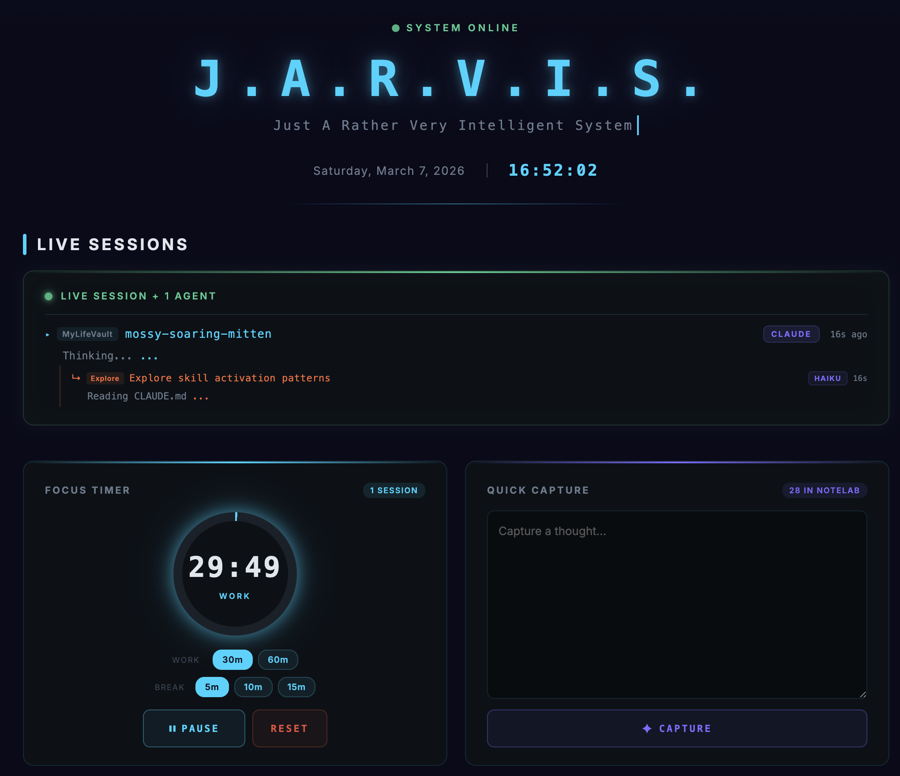
</p>

### Monitoring & Analytics

<table>
  <tr>
    <td align="center" width="50%">
      <strong>Live Session Monitor</strong><br>
      <em>Real-time Claude Code session tracking with subagent detection</em><br><br>
      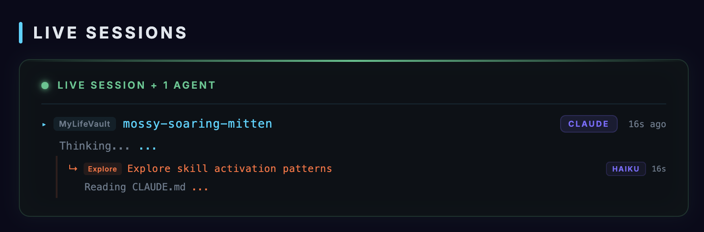
    </td>
    <td align="center" width="50%">
      <strong>Agent Cards</strong><br>
      <em>Visual AI agent fleet with unique robot avatars and live status</em><br><br>
      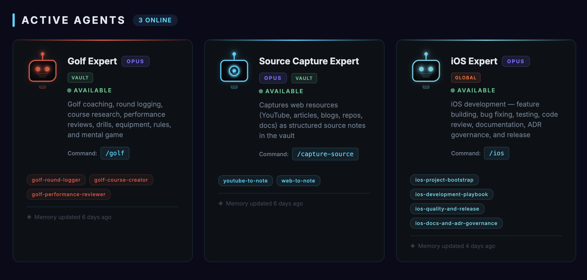
    </td>
  </tr>
  <tr>
    <td align="center" width="50%">
      <strong>System Diagnostics</strong><br>
      <em>30-day stats: sessions, tokens, cost, favorite model</em><br><br>
      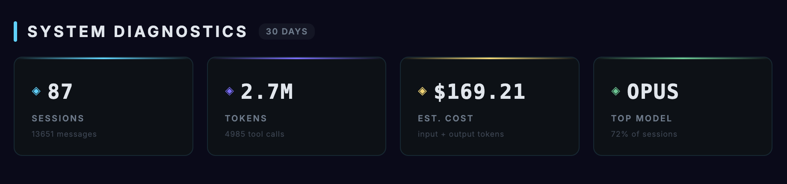
    </td>
    <td align="center" width="50%">
      <strong>Activity Analytics</strong><br>
      <em>Heatmap, peak hours chart, and model usage breakdown</em><br><br>
      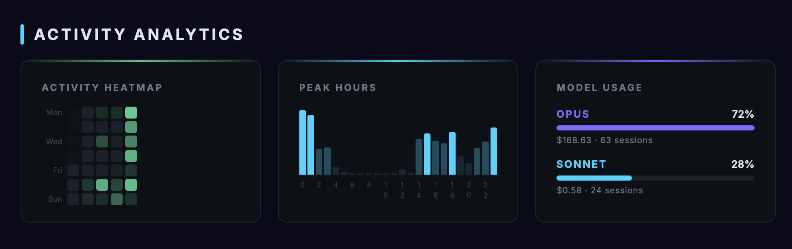
    </td>
  </tr>
</table>

### Productivity

<table>
  <tr>
    <td align="center" width="50%">
      <strong>Focus Timer</strong><br>
      <em>Pomodoro timer with circular progress and vault logging</em><br><br>
      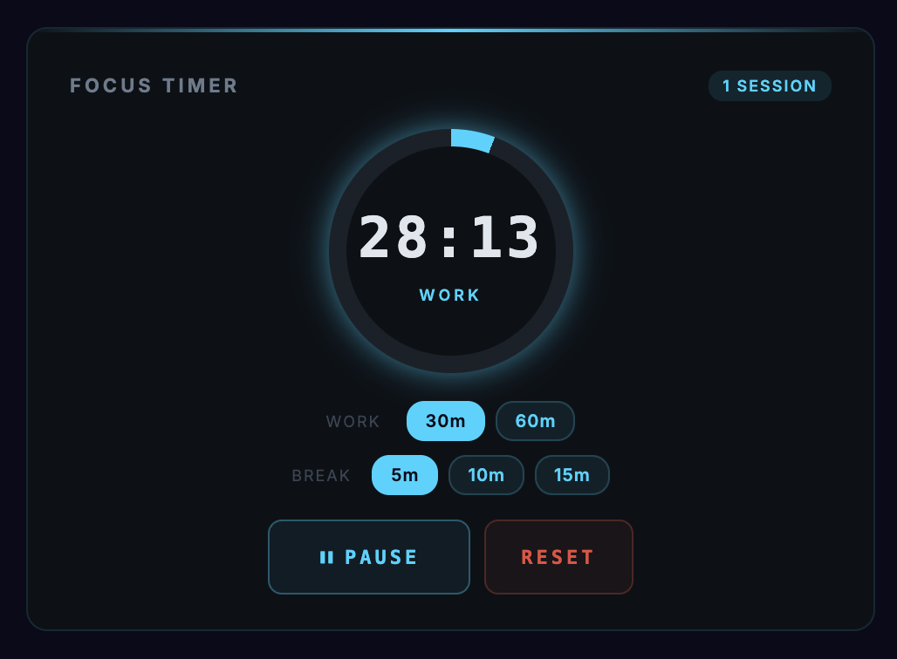
    </td>
    <td align="center" width="50%">
      <strong>Quick Capture</strong><br>
      <em>Instant note capture to your inbox folder</em><br><br>
      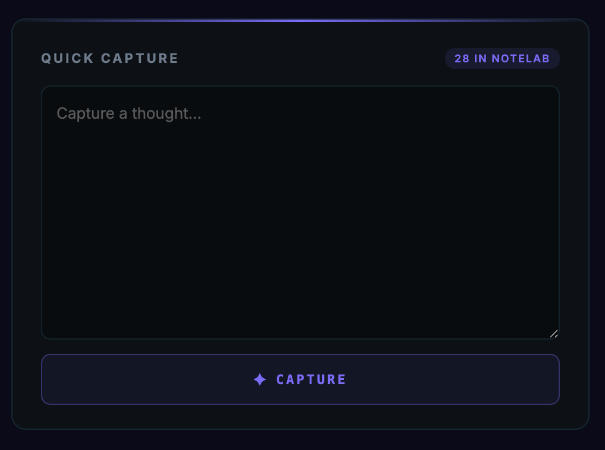
    </td>
  </tr>
</table>

### Navigation & Shortcuts

<table>
  <tr>
    <td align="center" width="50%">
      <strong>Communication Link</strong><br>
      <em>Terminal widget to launch Claude Code from Obsidian</em><br><br>
      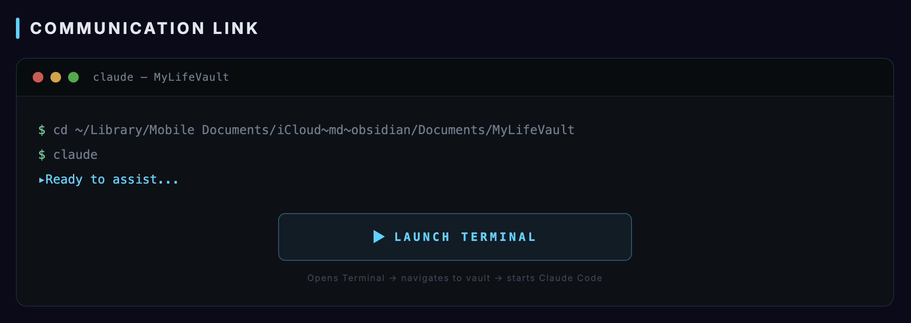
    </td>
    <td align="center" width="50%">
      <strong>Quick Launch</strong><br>
      <em>Configurable bookmark grid for apps and URLs</em><br><br>
      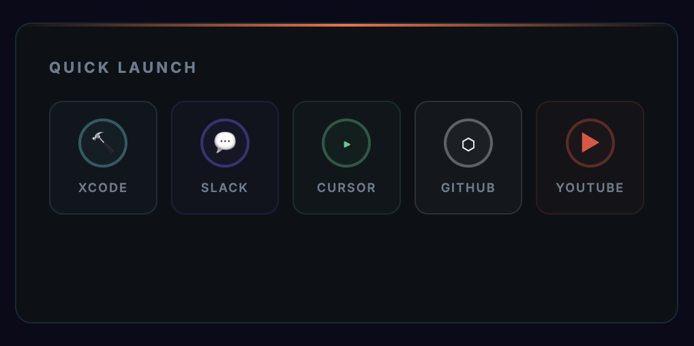
    </td>
  </tr>
  <tr>
    <td align="center" width="50%">
      <strong>Mission Control</strong><br>
      <em>Navigation hub linking to other vault dashboards</em><br><br>
      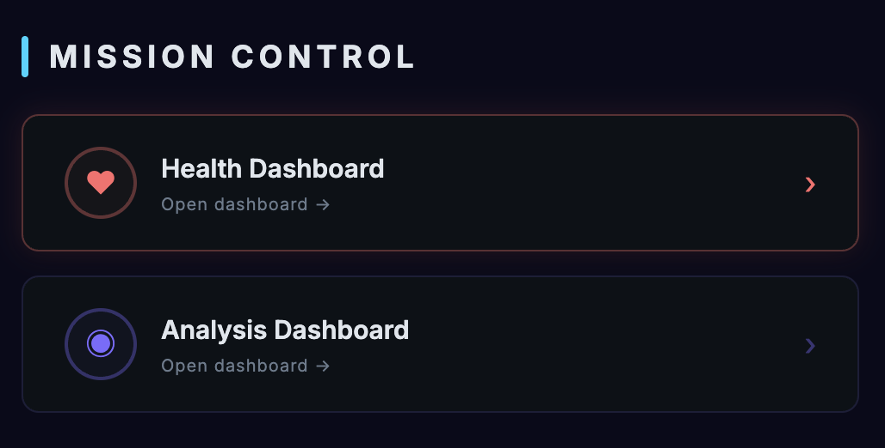
    </td>
    <td align="center" width="50%">
      <strong>Recent Activity</strong><br>
      <em>Feed of recently modified vault files</em><br><br>
      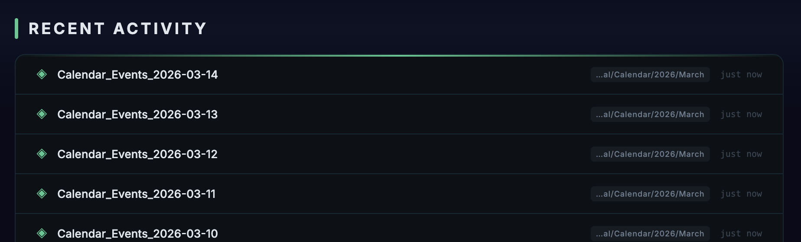
    </td>
  </tr>
</table>

## Installation

### Prerequisites

- [Obsidian](https://obsidian.md/) (v1.0+)
- [Dataview Plugin](https://github.com/blacksmithgu/obsidian-dataview) with **DataviewJS enabled**
  - Settings > Dataview > Enable JavaScript Queries > ON

### Setup

1. **Clone or download** this repository into your Obsidian vault:

   ```bash
   cd /path/to/your/vault
   git clone https://github.com/AndrewKochulab/jarvis-dashboard.git "MOCs/Jarvis Dashboard"
   ```

   Or download the ZIP and extract it into your vault (e.g., `MOCs/Jarvis Dashboard/`).

2. **Configure your projects** in `src/config/config.json`:

   ```json
   "projects": {
     "mode": "manual",
     "rootPath": "~/.claude/projects/",
     "tracked": [
       { "dir": "your-project-directory-name", "label": "My Project" }
     ]
   }
   ```

   > To find your project directory names, run: `ls ~/.claude/projects/`

3. **Open** `Jarvis Dashboard.md` in Obsidian — the dashboard renders automatically.

### Folder Placement

The dashboard can be placed anywhere in your vault. Recommended locations:

| Location | Use Case |
|---|---|
| `MOCs/Jarvis Dashboard/` | Standard MOC (Map of Content) structure |
| `Dashboards/Jarvis Dashboard/` | Dedicated dashboards folder |
| `Jarvis Dashboard/` | Root-level placement |

The dashboard auto-detects its own location and resolves `src/` paths relative to itself.

## Quick Start

After installation, the dashboard works with default settings. To customize it for your setup:

### 1. Set Your Projects

Find your Claude Code project directory names:

```bash
ls ~/.claude/projects/
```

Each directory name looks like `-Users-yourname-Projects-MyApp`. Add them to `config.json`:

```json
"projects": {
  "mode": "manual",
  "rootPath": "~/.claude/projects/",
  "tracked": [
    { "dir": "-Users-yourname-Projects-MyApp", "label": "MyApp" },
    { "dir": "-Users-yourname-Documents-vault", "label": "Vault" }
  ]
}
```

Or use **auto-scan** to discover all projects automatically:

```json
"projects": {
  "mode": "auto",
  "rootPath": "~/.claude/projects/"
}
```

### 2. Customize Your Bookmarks

Edit the Quick Launch bookmarks in `config.json`. You can organize them into **groups** — headers appear automatically when you have multiple groups:

```json
"quickLaunch": {
  "groups": [
    {
      "name": "Development",
      "bookmarks": [
        { "name": "Cursor", "icon": "\u25b8", "color": "#44c98f", "type": "app", "target": "Cursor" },
        { "name": "Xcode", "icon": "\ud83d\udd28", "color": "#56cfe1", "type": "app", "target": "Xcode" }
      ]
    },
    {
      "name": "Web",
      "bookmarks": [
        { "name": "GitHub", "icon": "\u2b21", "color": "#e0e6ed", "type": "url", "target": "https://github.com" }
      ]
    }
  ]
}
```

With a single group, headers are hidden and it renders as a flat grid. The legacy flat format is also supported:

```json
"quickLaunch": {
  "bookmarks": [
    { "name": "VS Code", "icon": "\u25b8", "color": "#007ACC", "type": "app", "target": "Visual Studio Code" },
    { "name": "GitHub", "icon": "\u2b21", "color": "#e0e6ed", "type": "url", "target": "https://github.com" }
  ]
}
```

### 3. Add Your Dashboards

Add navigation links to your other vault dashboards:

```json
"missionControl": {
  "dashboards": [
    { "name": "Health Dashboard", "path": "Dashboards/Health", "color": "#ff6b6b", "icon": "\u2665" }
  ]
}
```

## Configuration

All configuration lives in `src/config/config.json`. The file is organized into these sections:

### Theme

Customize all 15 colors:

```json
"theme": {
  "bg": "#0a0a1a",
  "panelBg": "#0d1117",
  "accent": "#00d4ff",
  "purple": "#7c6bff",
  "green": "#44c98f",
  "text": "#e0e6ed"
}
```

Only override the colors you want to change — defaults are applied for any missing values.

### Layout

The `layout` array controls which widgets appear, their order, and how they're grouped:

```json
"layout": [
  { "type": "header" },
  { "type": "live-sessions" },
  { "type": "row", "columns": 2, "widgets": ["focus-timer", "quick-capture"] },
  { "type": "agent-cards" },
  { "type": "system-diagnostics" },
  { "type": "footer" }
]
```

#### Layout Rules

| Entry Type | Behavior |
|---|---|
| `{ "type": "widget-name" }` | Renders widget full-width |
| `{ "type": "row", "columns": N, "widgets": [...] }` | Groups widgets side-by-side in N columns |

#### Customization Examples

**Remove a widget** — delete its entry from the layout array:
```json
// Remove activity analytics:
// Just don't include { "type": "activity-analytics" } in the layout
```

**Reorder widgets** — change the position in the array:
```json
"layout": [
  { "type": "header" },
  { "type": "agent-cards" },
  { "type": "live-sessions" },
  { "type": "footer" }
]
```

**Three widgets in a row**:
```json
{ "type": "row", "columns": 3, "widgets": ["focus-timer", "quick-capture", "quick-launch"] }
```

**Single-column on all screens**:
```json
{ "type": "row", "columns": 1, "widgets": ["focus-timer", "quick-capture"] }
```

### Projects — Manual vs Auto-Scan

#### Manual Mode (Default)

You specify exactly which projects to monitor:

```json
"projects": {
  "mode": "manual",
  "rootPath": "~/.claude/projects/",
  "tracked": [
    { "dir": "-Users-john-Projects-MyApp", "label": "MyApp" },
    { "dir": "-Users-john-Documents-vault", "label": "Vault" }
  ]
}
```

- `dir`: The directory name inside `~/.claude/projects/` (run `ls ~/.claude/projects/` to find them)
- `label`: Display name shown on the dashboard

#### Auto-Scan Mode

The dashboard automatically discovers all Claude Code project directories:

```json
"projects": {
  "mode": "auto",
  "rootPath": "~/.claude/projects/"
}
```

In auto-scan mode:
- All subdirectories in `~/.claude/projects/` are detected
- Labels are automatically derived from the last segment of each directory name
- Results are cached for 60 seconds to maintain performance
- No manual configuration needed — new projects appear automatically

### Widget Configuration

Each widget has its own configuration section under `"widgets"`:

#### Focus Timer

```json
"focusTimer": {
  "workPresets": [
    { "label": "25m", "ms": 1500000 },
    { "label": "50m", "ms": 3000000 }
  ],
  "breakPresets": [
    { "label": "5m", "ms": 300000 },
    { "label": "15m", "ms": 900000 }
  ],
  "logPath": "Productivity/Focus Logs"
}
```

Focus session logs are automatically created as Markdown files with frontmatter, tables, and summary statistics.

#### Quick Capture

```json
"quickCapture": {
  "targetFolder": "Inbox",
  "tag": "inbox/capture"
}
```

Captures create timestamped notes with the specified tag in the target folder.

#### System Diagnostics

```json
"systemDiagnostics": {
  "periodDays": 30,
  "cacheDurationMs": 300000
}
```

Analytics are computed from Claude Code session transcripts and cached for performance.

#### Communication Link

```json
"communicationLink": {
  "terminalApp": "Terminal",
  "editorApp": "Cursor",
  "terminalTitle": "claude \u2014 My Project",
  "vaultPathDisplay": "~/my-vault"
}
```

### Agent Registry

Agent definitions live in `src/config/Jarvis-Registry.md`. See the file for full documentation on adding, editing, and configuring agents.

Quick reference for required fields:

| Field | Description |
|---|---|
| `name` | Unique identifier (used for robot avatar and status matching) |
| `displayName` | Human-readable name on the card |
| `model` | `opus`, `sonnet`, or `haiku` |
| `color` | Hex color for card accent and robot |
| `location` | `vault` or `global` |
| `configPath` | Path to agent config file |
| `description` | Short capability description |

Optional: `skills` (list), `command` (string), `memoryDate` (YYYY-MM-DD).

### Pricing

Token cost estimation uses configurable per-million-token rates:

```json
"pricing": {
  "opus": { "input": 15, "output": 75 },
  "sonnet": { "input": 3, "output": 15 },
  "haiku": { "input": 0.80, "output": 4 }
}
```

Update these values when Anthropic changes pricing.

## Widgets

### Live Session Monitor

Monitors Claude Code JSONL transcript files in real-time. Detects:
- Active sessions across multiple projects
- Current tool being used (Read, Edit, Bash, Agent, etc.)
- Model in use (Opus, Sonnet, Haiku)
- Active subagents with descriptions and types
- Agent registry matches (highlights which registered agent is active)

Polls every 3 seconds. Shows elapsed time for each session.

### Agent Cards

Renders registered agents as interactive cards with:
- **Unique robot avatars** — automatically generated based on agent name, with three eye styles (visor, lens, dual-dot)
- **Live status** — switches between "Available" and "Working" based on session detection
- **Active animations** — breathing effect, orbiting glow ring, pulsing dot when working
- **Click to open** — opens the agent's config file in your editor
- **Skills pills** — visual list of registered skills
- **Memory freshness** — shows when agent memory was last updated

### Activity Analytics

Three visualization panels:
1. **Activity Heatmap** — GitHub-style 30-day grid showing message volume per day
2. **Peak Hours** — 24-bar chart showing activity distribution across hours
3. **Model Usage** — Horizontal bar chart with percentage, session count, and cost per model

### Focus Timer

Full Pomodoro implementation:
- Circular progress ring with conic gradient
- Configurable work/break duration presets
- Start, Pause, Resume, Reset controls
- Session counter (resets daily)
- Automatic work/break switching on completion
- System notifications (requires browser notification permission)
- Vault logging — creates/updates daily focus log files with tables and statistics

## Architecture

### Module Loading

DataviewJS cannot use `import/export`. Instead, each `.js` file is loaded as a function body:

```javascript
const code = fs.readFileSync("src/widgets/header.js", "utf8");
const widgetFn = new Function("ctx", code);
const element = widgetFn(ctx);
```

### Shared Context (`ctx`)

All modules receive a shared `ctx` object — the single dependency injection point:

```javascript
ctx = {
  // Core
  el, T, config, container, dv, app,

  // Layout
  isNarrow, isMedium, isWide,

  // Services
  sessionParser, statsEngine, timerService,

  // Data
  agents, agentNames, skillToAgent,

  // Cross-widget communication
  agentCardRefs,    // Map: agent name -> DOM refs
  onStatsReady,     // Array: callbacks for async stats
  intervals,        // Array: all setInterval IDs for cleanup
}
```

### SOLID Principles

| Principle | Implementation |
|---|---|
| **Single Responsibility** | Each widget file handles exactly one dashboard section |
| **Open/Closed** | New widgets added by creating a `.js` file and adding to layout — no existing code modified |
| **Liskov Substitution** | All widgets follow the same contract: `(ctx) -> HTMLElement` |
| **Interface Segregation** | Widgets only access the `ctx` properties they need |
| **Dependency Inversion** | Widgets depend on `ctx` abstraction, not concrete implementations |

### Creating Custom Widgets

1. Create `src/widgets/my-widget.js`:

```javascript
// My Widget
// Returns: HTMLElement

const { el, T, config, isNarrow } = ctx;

const section = el("div", {
  background: T.panelBg,
  border: `1px solid ${T.panelBorder}`,
  borderRadius: "12px",
  padding: isNarrow ? "16px 14px" : "20px 24px",
});

section.appendChild(el("div", {
  fontSize: "14px", color: T.text,
}, "Hello from my widget!"));

return section;
```

2. Add to layout in `config.json`:

```json
"layout": [
  { "type": "header" },
  { "type": "my-widget" },
  { "type": "footer" }
]
```

3. Register in `Jarvis Dashboard.md` widget map (inside the DataviewJS block):

```javascript
const WIDGET_MAP = {
  // ... existing widgets ...
  "my-widget": "widgets/my-widget.js",
};
```

## Platform Support

### Primary Platform

**Obsidian** (macOS, Linux, Windows) with the DataviewJS plugin. This is the primary and fully supported platform.

### Obsidian-Specific APIs Used

| API | Used By | Purpose |
|---|---|---|
| `dv.pages()` | Recent Activity, Quick Capture, Footer | Query vault content |
| `dv.page()` | Orchestrator | Load agent registry |
| `app.workspace.openLinkText()` | Mission Control, Recent Activity | In-vault navigation |
| `new Notice()` | Multiple widgets | Toast notifications |
| `app.vault.adapter.basePath` | Multiple widgets | Vault root path |

### macOS-Specific Features

| Feature | API | Alternative for Other OS |
|---|---|---|
| Launch Terminal | `osascript` | Change `terminalApp` in config; Linux users can modify the launch command |
| Open Apps | `open -a` | Linux: `xdg-open`; Windows: `start` |
| Open URLs | `open` | Linux: `xdg-open`; Windows: `start` |

### Potential Adaptations

The modular architecture makes it possible to adapt the dashboard for other platforms:

- **LogSeq** — Would require a custom JS renderer plugin; core logic is reusable
- **VS Code** — Could be implemented as a webview extension using the same widget modules
- **Standalone HTML** — Would need a Node.js backend for filesystem access; all DOM rendering code is portable
- **Electron App** — Most direct port; all code uses standard DOM APIs + Node.js

These adaptations would require community contributions and are not currently maintained.

## File Structure

```
jarvis_dashboard/
  README.md                         You are here
  LICENSE                           MIT License
  Jarvis Dashboard.md               Main entry point (open this in Obsidian)
  src/
    config/
      config.json                   All configurable values
      Jarvis-Registry.md            Agent definitions
    core/
      theme.js                      Theme colors & responsive sizing
      styles.js                     CSS animations (12 keyframes)
      helpers.js                    Utilities: el(), formatters
    services/
      session-parser.js             JSONL transcript parsing
      stats-engine.js               30-day analytics engine
      timer-service.js              Focus timer persistence
    widgets/
      header.js                     Title, clock, status
      live-sessions.js              Real-time session monitor
      system-diagnostics.js         Stats cards
      agent-cards.js                Robot avatars & agent grid
      activity-analytics.js         Heatmap, charts
      communication-link.js         Terminal widget
      focus-timer.js                Pomodoro timer
      quick-capture.js              Note capture
      quick-launch.js               Bookmark grid (grouped or flat)
      mission-control.js            Navigation hub
      recent-activity.js            Recent files feed
      footer.js                     Summary footer
  assets/
    banner.svg                      README banner
    widgets/                        Widget screenshots (user-provided)
      quick-look.png
      live-sessions.png
      agent-cards.png
      system-diagnostics.png
      activity-analytics.png
      focus-timer.png
      quick-capture.png
      communication-link.png
      quick-launch.png
      mission-control.png
      recent-activity.png
```

## Contributing

Contributions are welcome! Here are some areas where help is appreciated:

- **New widgets** — Follow the widget contract (`ctx -> HTMLElement`) and submit a PR
- **Cross-platform support** — Adapt launch commands for Linux/Windows
- **Themes** — Create and share alternative color schemes
- **Documentation** — Improve setup guides, add screenshots, record demos

### Development Workflow

1. Fork and clone the repository into an Obsidian vault
2. Make changes to widget/service files
3. Re-open `Jarvis Dashboard.md` in Obsidian to test
4. Submit a pull request with a description of your changes

## License

[MIT](LICENSE) - Andrew Kochulab
