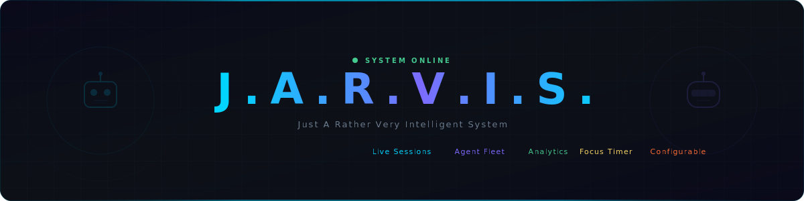

# Demo & Screenshots

## Full Dashboard

*The complete Jarvis Dashboard running in Obsidian Desktop*

## Voice Command in Action

*Real-time voice interaction with JARVIS — recording, transcription, Claude response, and TTS playback*

## Widget Screenshots

Individual widget screenshots are available in the `assets/widgets/` directory:

| Widget | Screenshot |
|---|---|
| Header | `assets/widgets/header.png` |
| Voice Command | `assets/widgets/voice-command.png` |
| Live Sessions | `assets/widgets/live-sessions.png` |
| Agent Cards | `assets/widgets/agent-cards.png` |
| Focus Timer | `assets/widgets/focus-timer.png` |
| Quick Capture | `assets/widgets/quick-capture.png` |
| Activity Analytics | `assets/widgets/activity-analytics.png` |
| System Diagnostics | `assets/widgets/system-diagnostics.png` |

## Platform Screenshots

### macOS (Tauri)

*Screenshot placeholder — to be added*

The macOS Tauri app provides the full dashboard experience as a standalone desktop application with native menu bar integration.

### iOS

*Screenshot placeholder — to be added*

The iOS app provides a mobile-optimized voice command interface with connection to the companion server.

### Obsidian Mobile

*Screenshot placeholder — to be added*

Obsidian Mobile renders the voice-only interface within a DataviewJS note.

## Videos

*Video links to be added — planned demo recordings of:*

1. Full dashboard tour (all widgets)
2. Voice command flow (record → transcribe → Claude → TTS)
3. Interactive mode (permission cards, tool approvals)
4. iOS app setup and usage
5. Multi-session management
